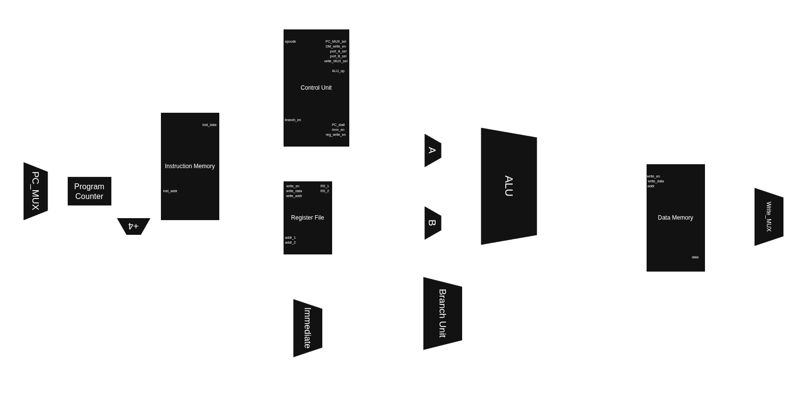

# Project Overview

### RV32I ISA Overview
RV32I is the base integer instruction set architecture for the 32-bit variant of the RISC-V ISA. It is the foundation for the RISC-V architecture, providing the minimal set of instructions required to build a processor capable of supporting modern operating systems.

This particular RV32I design was implemented with a 5-stage pipelined process:
`Fetch > Decode > Execute > Memory > Write Back`

## Block Diagram

## Instruction Types

|  Type  |  Operation |
|--------|------------|
| R-Type | Register to register arithmetic/logical operations           |
| I-Type | Arithmetic/logical, load, JAL operations with an immmediate value            |
| S-Type | Store operations, writing data from a register to memory            |
| B-Type | Conditional branch            |
| U-Type | Load upper immediate (lui)            |
| J-Type | Unconditional jumps           |

# RTL Design & Synthesis
For the synthesis, the design uses the `sky130_fd_sc_hd__tt_100C_1v80` library. A high-density standard cell library characterized at the typical-typical process corner, 1.8V core voltage, and 100°C operating temperature.

## Used Tools (EDA/IDEs)
- Neovim (RTL Design)
- ModelSim (Functional Verification)
- Yosys (Synthesis)
- OpenSTA (Timing Analysis)
- Git (Version Control)
